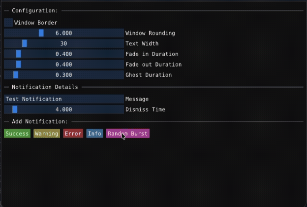

 

 

# Toast-like Notification system for Dear ImGui

ImGuiToastr is a toast-like notification system for
[Dear ImGui](https://github.com/ocornut/imgui) based on the popular
[Toastr extension](https://github.com/CodeSeven/toastr) for JavaScript from years ago.
In this context, a Toast is a popup notification (also known as a snackbar, desktop notification,
notification bubble, or simply notification) implemented as a graphical control element that
communicates events to the user without forcing them to react to this notification immediately,
unlike conventional pop-up windows. Notifications are rendered as a stack from a specified anchor
and direction and they disappear automatically after a specified amount of time.

## Features

- Works on MacOS, Linux and Windows.
- Works with latest Dear ImGui version (currently v1.92.8 && v1.92.9) and does not use deprecated functions.
- Is C++17 based (not unreasonable in 2026 I think) although Dear ImGui still uses C++11.
- Has no runtime dependencies other than Dear ImGui and the C++17 Standard Template Library (STL).
- Provides toasts for Success, Warning, Error and Info notifications.
- Notification can be multiple lines (with either "\n" in string or by using wordwrap).
- Notifications can be variable width (as wide as it needs to be for the message) or fixed width (with wordwrap).
- Provides default and custom color palettes. Example application has a custom color palette editor.
- Provides configuration option for window decorations and timings.
- Has configurable fade-in, display, fade-out and ghost timings (see life cycle of a notification below).
- By rolling over a notification, a close box appear to delete the notification before the time is up.
- Notifications can also be dismissed through the API.
- When multiple notifications are active, they will be rendered as a stack starting at a specified anchor point and growing in a specified direction.
- The built-in icons can be overridden by providing a custom icon renderer callback.
- Icons can be hidden in which case a narrow vertical stripe is shown.
- Optional progress bars can be shown to depict display time remaining.

## Integration

This repository provides a simple mechanism to use the Toast-like notification system
in any Dear ImGui context by doing the following:

- Include the Toastr.cpp and Toastr.h files in your project.
- Instantiate a Toastr object and configure it to your taste.
- Call Render ones per Dear ImGui frame to render the stack of active notifications.
- Use the Success, Warning, Error and Info methods to add notifications.

## Life Cycle of a Notification

When a notification is created, it enters a 4 step life cycle:

- During step 1, the notification will fade-in in accordance with the configured settings.
- During step 2, the notification will be displayed in accordance with the configured settings.
- During step 3, the notification will fade-out in accordance with the configured settings.
- During step 4, the notification will no longer be visible but its space will "collapse" in accordance with configured settings (providing a pleasing visual animation).
- Once step 4 is completed, the notification will be permanently deleted.

## Versioning

This repository includes releases with a numbering scheme synchronized with Dear ImGui.
This will allow people to quickly find a version of the widgets compatible with a specific Dear ImGui version.

## Issues

If you are interested in using this Toast-Style notification system, steal parts of the code,
make suggestions for improvements or contribute fixes/enhancements, be my guest as this
repository is released under the MIT license. For people that want to contribute,
[Contributing Guidelines](CONTRIBUTING) and a [Code of Conduct](CODE_OF_CONDUCT.md)
are available. If you find any problems or want to make a suggestion for improvement, please
[raise an issue on this repository](https://github.com/goossens/ImGuiToastr/issues).

## Credits

This version of ImGuiToastr was written from scratch by [Johan A. Goossens](https://github.com/goossens)
and if you end up using (parts of) this repository, a shoutout or Github star would be appreciated.
Other notification systems exist on Git but many of them have not been maintained for a bit.

Thank you to [Omar Cornut](https://github.com/ocornut/imgui) for creating Dear ImGui
in the first place. Without you, this notification system would not exist.

## License

This work is licensed under the terms of the MIT license.
For a copy, see <https://opensource.org/licenses/MIT>.
